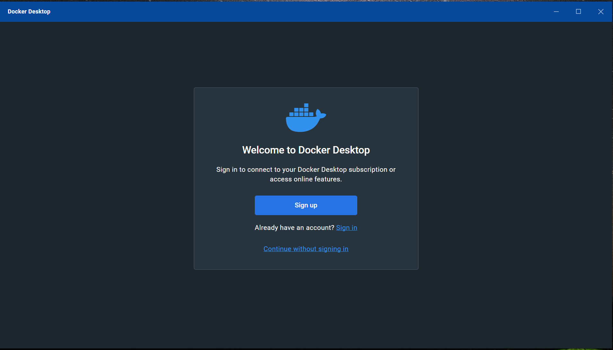

# Introduction

This help file guides one through the steps of running the solution in windows using [Docker Desktop](https://www.docker.com/products/docker-desktop/). Step-by-step installation is not in-scope for this document.

## Prerequisites

1. [Docker Desktop](https://www.docker.com/products/docker-desktop/). If the link is not clickable for some reason, you may copy this: `https://www.docker.com/products/docker-desktop/` and paste in the browser of your preference
1. Compatible MS Windows :tm version. No support can be provided for incompatible versions

# Steps

## Launch docker desktop with or without signup

This step will only be relevant once per Docker Desktop installation.

# Post-deployment

You may continue from where you left off at the [README](./README.md#calling-via-docker-image)

